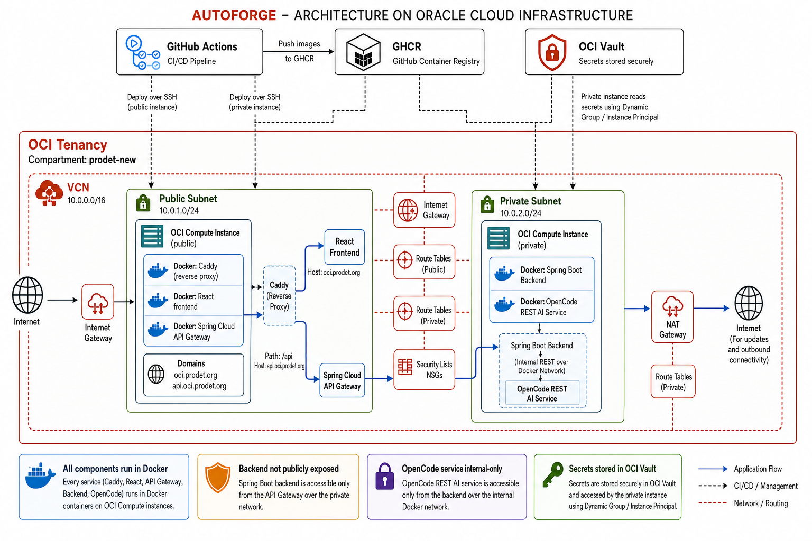

# Architecture

## Deployment shape

- Public OCI instance:
  - React frontend
  - Spring Cloud API gateway
  - reverse proxy / Caddy
- Private OCI instance:
  - Spring Boot backend service
  - OpenCode REST AI service
  - worker service

## Delivery model

- Every component runs in Docker.
- Build and deployment flow will be driven by GitHub Actions.
- The public host serves as the external entry point via Caddy, which routes `/api` to the API gateway and everything else to the web frontend.
- The private host serves internal application workloads.

## Current status

- React chosen for frontend.
- Frontend scaffolded with Vite + TypeScript.
- Frontend now has a deployable Docker image definition.
- Frontend build workflow prepared in GitHub Actions.
- Backend scaffolded with Spring Boot + Maven.
- Backend deploys from a registry image in the private stack.
- Backend build workflow prepared in GitHub Actions.
- Docker Compose stacks are defined for the public and private OCI hosts.
- Manual GitHub Actions deploy workflows are prepared for both hosts.
- The private host now also runs an OpenCode REST AI service for backend-driven AI tasks.
- Worker runtime not selected yet.
- Active work branch names include the task ID prefix without any extra namespace prefix.
